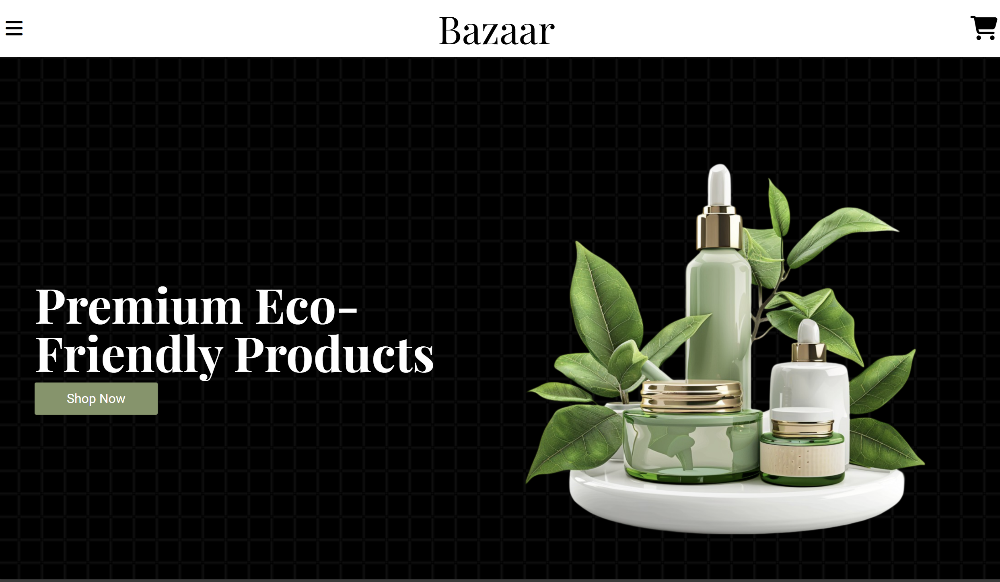

# Bazaar

A responsive and functional shopping cart application built as part of [The Odin Project](https://www.theodinproject.com/) curriculum. This project showcases key concepts in modern React development, including routing, state management, and responsive design.

## Features

- **Dynamic Routing**: Leveraging React Router for seamless navigation between pages.
- **State Management**: Efficient use of React's `useContext` for global state handling.
- **Side Effects**: Managing lifecycle events with `useEffect`.
- **Responsive Design**: Styled with Tailwind CSS to ensure a clean, mobile-first layout.
- **Interactive Shopping Experience**: Add, remove, and update items in the cart dynamically.
- **API Integration**: Fetching product data from the FakeStore API.

## Tech Stack

- **Frontend**: React (with Hooks)
- **Styling**: Tailwind CSS
- **Routing**: React Router
- **Development Tools**: Vite, ESLint, Prettier

## Screenshots

## Key Learning Outcomes

- **React Router**: Built multi-page functionality with efficient routing.
- **useEffect**: Controlled side effects such as fetching data and handling updates.
- **useContext**: Managed the shopping cart state globally for a consistent user experience.
- **Tailwind CSS**: Practiced responsive design principles and utility-first styling.

## Future Improvements

- Add backend support for persistent data storage.
- Implement unit testing with Jest and React Testing Library.
- Expand the product catalog with more detailed filtering and sorting features.

## Contributing

Feel free to contribute to this project. Fork the repository, make your changes, and submit a pull request!
